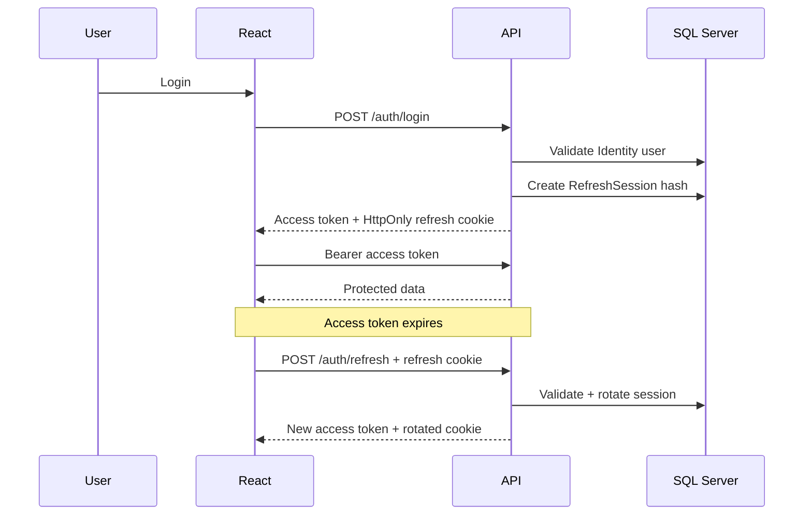

# Phase 2 - Authentication & Accounts

## Previous Authentication Architecture

- Access tokens were persisted in `localStorage`.
- Registration automatically set `EmailConfirmed = true`.
- Login used `lockoutOnFailure: false`.
- Refresh tokens were generated and returned in JSON but not persisted or validated.
- Logout only called `SignInManager.SignOutAsync`, which does not revoke JWT/refresh sessions.
- Frontend route protection was mostly layout-level and did not wait for auth restoration.

## New Architecture

- ASP.NET Core Identity remains the account source of truth.
- JWT access tokens are short-lived and returned to the React app.
- Refresh tokens are generated as cryptographically secure random values, stored only in an HttpOnly cookie, and persisted server-side as SHA-256 hashes in `RefreshSessions`.
- The React app stores access tokens in module memory only.
- On page load, React calls `POST /api/v1/auth/refresh` with credentials to restore the session.
- Axios uses a single-flight refresh promise so concurrent 401 responses do not trigger uncontrolled refresh rotations.

## Token Lifecycle

- Access token lifetime: configurable by `Authentication:AccessTokenMinutes`, default 15 minutes.
- Refresh token lifetime: configurable by `Authentication:RefreshTokenDays`, default 21 days.
- Refresh token hash strategy: SHA-256 hex string. Raw refresh tokens are never stored in the database.
- Refresh rotation: a valid refresh consumes the current session, creates a replacement in the same family, and sets a new cookie.
- Replay behavior: reuse of a revoked refresh token revokes the token family.
- Password reset and password change revoke all active refresh sessions for the user.

## Cookie, CORS, And CSRF

- Cookie name: `Authentication:RefreshCookieName`, default `amaara_refresh`.
- Cookie settings:
  - `HttpOnly = true`
  - `Secure = true` outside Development
  - `SameSite = Lax`
  - `Path = /api/v1/auth`
- CORS still uses explicit configured origins and allows credentials.
- CSRF exposure is limited because normal business APIs require Bearer tokens. Cookie-dependent endpoints are auth/session endpoints only and use `SameSite=Lax` plus configured CORS origins.

## Account Flows

- Registration creates an unconfirmed Customer user and sends a verification email through `IEmailService`.
- Login requires confirmed email and uses Identity lockout.
- Forgot password always returns a generic response.
- Reset password uses Identity reset tokens delivered through email abstraction and revokes active sessions.
- Change password is authenticated and revokes active sessions, requiring re-login.
- Logout revokes the current refresh session and clears the cookie.
- Logout-all revokes all active user sessions.

## Email Configuration

- `IEmailService` is implemented with a development sink.
- In Development, tokenized verification/reset URLs are logged for local testing.
- Outside Development, tokenized URLs are not logged; production SMTP/provider credentials still need to be configured by replacing the service implementation.
- Frontend link base URL is configured by `Authentication:FrontendBaseUrl`.

## Roles And Policies

Roles:

- `Customer`
- `Admin`
- `SuperAdmin`

Policies:

- `AdminAccess`
- `ManageCustomers`
- `ManageOrders`
- `ManageCatalog`
- `ManageContent`
- `ManageReviews`
- `ViewReports`

Existing `Admin` users are preserved. Explicit bootstrap creates/updates a `SuperAdmin` only when configured.

## Saved Addresses

Added authenticated address endpoints:

- `GET /api/v1/addresses`
- `GET /api/v1/addresses/{id}`
- `POST /api/v1/addresses`
- `PUT /api/v1/addresses/{id}`
- `DELETE /api/v1/addresses/{id}`
- `POST|PUT /api/v1/addresses/{id}/default`

Rules:

- User ID is always derived from claims.
- Users can only access their own addresses.
- First address becomes default automatically.
- Setting default clears other defaults for that user.
- Deleting a default address promotes the most recently updated remaining address.

## Frontend Routes

- `/forgot-password`
- `/reset-password`
- `/verify-email`
- `/account/security`
- `/addresses`

Protected routes now wait for auth restoration before redirecting. Admin routes use `ProtectedRoute requireAdmin`.

## Files Added

- Backend auth/session/email/policy services and DTOs.
- `AddressesController`.
- Frontend `ProtectedRoute`, `authSession`, address service, and auth/account pages.
- Tests for refresh-token hashing and memory-only token storage.

## Migration Changes

- No new schema migration was required. Phase 1 already added `RefreshSessions` and `Addresses`.

## Commands Executed

- `dotnet build be\be.csproj --no-restore --configuration Release`
- `dotnet test tests\be.Tests\be.Tests.csproj --configuration Release --no-restore`
- `dotnet ef migrations list --project be\be.csproj --startup-project be\be.csproj --configuration Release --no-build`
- `npm ci`
- `npm install`
- `npm run lint`
- `npm run typecheck`
- `npm test`
- `npm run build`
- `npm audit --audit-level=high`

## Results

- Backend build: passed.
- Backend tests: passed, 7 tests.
- `npm ci`: blocked by a Windows `EPERM` file lock on Rollup native binaries under `node_modules` and the local Node 20 versus required Node 22 engine warning.
- `npm install`: repaired dependencies and reported 0 vulnerabilities.
- Frontend lint: passed with the existing 3 admin hook dependency warnings.
- Frontend typecheck: passed.
- Frontend tests: passed, 4 tests.
- Frontend build: passed.
- Frontend audit: passed, 0 vulnerabilities.
- EF migration list: Phase 1 migration is visible; applied/pending status unavailable because local SQL Server is unreachable.

## Manual Environment Configuration Required

- Configure production `Jwt:Key` through secrets/environment variables.
- Configure production `Authentication:FrontendBaseUrl`.
- Replace the development email sink with a real SMTP/provider-backed `IEmailService`.
- Apply existing migrations to SQL Server and smoke-test full auth flows against the database.

## Known Limitations

- Production email delivery is not configured in source control.
- Live database smoke tests were not completed because SQL Server was unreachable in this environment.
- Development email sink logs tokenized URLs only in Development to support local verification/reset testing.

## Phase 3 Readiness

Phase 3 can assume secure session restoration, account verification, password recovery, saved addresses, and policy-based admin foundations are present on `develop`.
